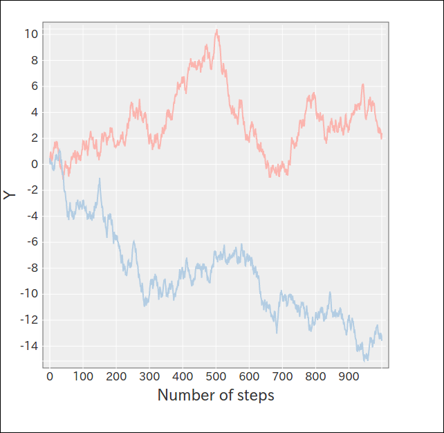

Getting Started
===============

.. _import-docs:

Installation
------------

Run the line shown below to install nyaplotjs to your local project.

.. code-block:: shell

                npm install nyaplot

Try nyaplotjs using Simple API
------------------------------

.. code-block:: html

                <html>
                  <head>
                    
                    
                    
                  </head>
                  <body>
                    

                  </body>
                </html>

Prepare data to visualize.
                
.. code-block:: javascript

                var xarr=[], yarr1=[], yarr2=[], N=1000, curry1=0.0, curry2=0.0;
                for(var i=0;i < N;i++){
                  xarr.push(i);
                  yarr1.push(curry1+=(Math.random()-0.5));
                  yarr2.push(curry2+=(Math.random()-0.5));
                }

Specify div element which svg will be appended to ("vis" in this example) and begin rendering.
                
.. code-block:: javascript

                var plot = new Nyaplot.Plot({xlabel: "Number of steps"});
                var line1 = new Nyaplot.Line(xarr, yarr1, {color: "#fbb4ae"});
                var line2 = new Nyaplot.Line(xarr, yarr2, {color: "#b3cde3"});
       
                plot.add([line1, line2]);
                plot.show("vis");

Try more
--------

Read the code here_ to try more examples.

.. _here: https://github.com/domitry/Nyaplotjs/tree/v2/examples
